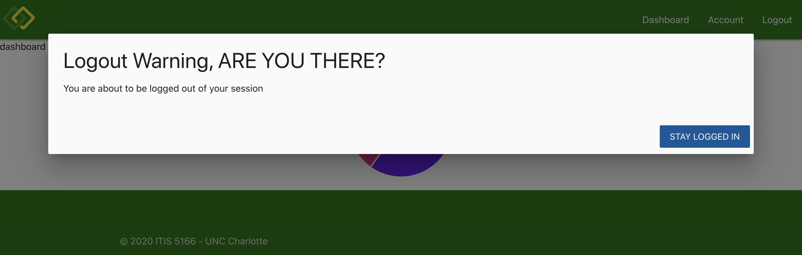

# Personal Budget App ITIS 5166

## Getting started

- Clone this repo

- Run `npm install` in the root directory and run `npm start` and the application will launch at `localhost:3000`

## Live Demo

This project is hosted with heroku. Both the UI and API instance have to be up and running in heroku (since this is free, the servers may take ~15 seconds to awaken when urls are first hit)

navigate to [https://personal-budget-ui-2.herokuapp.com/](https://personal-budget-ui-2.herokuapp.com/) to see this application live

you can check to ensure the backend api is being served up as well when navigating to [https://personal-budget-api.herokuapp.com/test](https://personal-budget-api.herokuapp.com/test)

## homepage - NOT logged in

- unauthenticated route
  

## signup page

- unauthenticated route
  

## login page

- unauthenticated route
  

## local storage

- json web token is saved to local storage as well as our user id and json token expiration time
  

## homepage - logged in

- unauthenticated route
  

## account page

- authenticated route
- user can update their account
  

## dashboard page

- authenticated route
- if a user has not yet entered a budget, this view is shown where users can click the button to create a budget chart
  

## create budget page

- authenticated route
- users can create a budget here
  

## color picker

- color picker makes it easier for users to choose a color
  

## create budget page

- authenticated route
- once a user has entered in a value, an example of what their budget will look like will render onto the page
  

## logout modal

- since we saved our expiration date to be 60 seconds after the json token was received on the client, we know when to log the user out. 20 seconds prior to being logged out, the user will receive a modal popup that prompts the user to stay logged in. if they do not click stay logged in, they will be logged out
  
